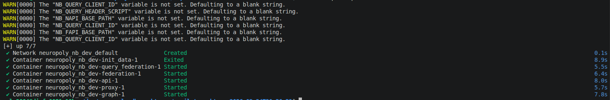
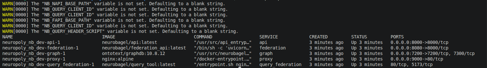
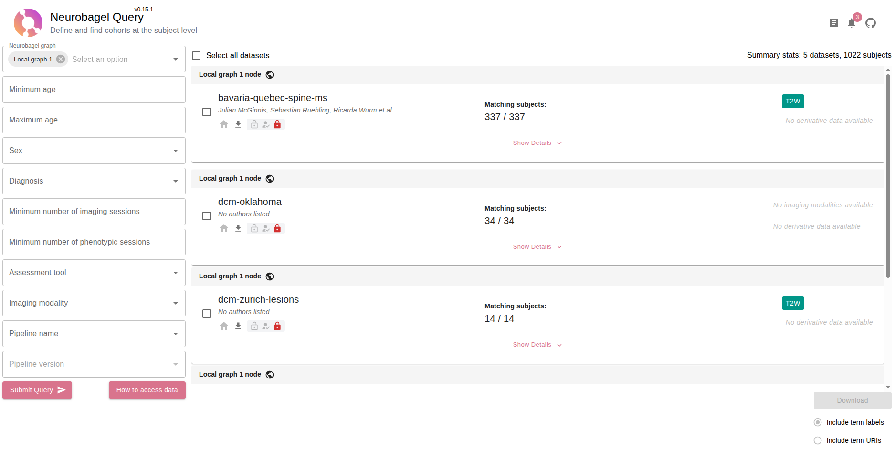

# NeuroBagel node deployment

> [!WARNING]
> To deploy a **production-ready NeuroBagel node**, refer to the [NeuroBagel documentation](https://neurobagel.org/user_guide/production_deployment) instead of the instructions below.

## Prerequisites

### On Linux

|                    |               |
|--------------------|---------------|
| **Docker engine**  | &geq; v29.1.4 |
| **Docker Compose** | &geq; v5.0.0  |

Follow these [installation steps](https://docs.docker.com/engine/install/ubuntu/). **Ensure you can [use docker as non-root user](https://docs.docker.com/engine/install/linux-postinstall/#manage-docker-as-a-non-root-user)**.

> [!WARNING]
> Docker desktop is available on Linux. However, performances and stability are better with the Docker engine. If you choose to use Docker Desktop, ensure you have the latest version installed.

### On Windows and MacOS

|                    |               |
|--------------------|---------------|
| **Docker Desktop** | &geq; v4.56.0 |

Install **[Docker Desktop &geq; v4.56.0](https://docs.docker.com/get-started/get-docker/)**.

> [!CAUTION]
> **MacOS** and **Windows** should not require users **to use `sudo` with Docker commands**. If you encounter this issue, prefixing all docker commands below with `sudo` should be safe in the current context. However, **it is recommended you reinstall Docker Desktop from scratch to prevent any security issues**. If the problem persists, get in touch with the Docker Team on the [official forums](https://forums.docker.com).

## Installation

1. Clone the [neuropoly-db repository](https://github.com/neuropoly/neuropoly-db) locally :

   ```bash
   git clone https://github.com/neuropoly/neuropoly-db.git
   ```

2. Navigate to the root of the repository :

   ```bash
   cd neuropoly-db
   ```

3. Initialize the submodules :

   ```bash
   git submodule update --init --recursive
   ```

4. Copy the `template.env` environment template to `.env` :

   ```bash
   cp template.env .env
   ```

   > [!IMPORTANT]
   > NeuroBagel services run on multiple ports on `localhost`. If you have services or software running on your machine, **some of the ports used by NeuroBagel might be in use**. Refer to the **table below** for the list of ports used by NeuroBagel and change them in the `.env` file if needed :
   >
   > | Service                     | Port variable        | Default port |
   > |-----------------------------|----------------------|--------------|
   > | NeuroBagel Query            | `NB_QUERY_PORT_HOST` | 9000         |
   > | NeuroBagel Graph            | `NB_GRAPH_PORT_HOST` | 7200         |
   > | NeuroBagel API              | `NB_API_PORT_HOST`   | 8000         |
   > | NeuroBagel Federation API   | `NB_FAPI_PORT_HOST`  | 8080         |

5. Deploy the NeuroBagel node with Docker Compose :

   ```bash
   docker compose up -d
   ```

   

   > [!WARNING]
   > You can ignore the **warnings** of unset environment variables when running the above command.

6. Verify all containers are up and running :

   ```bash
   docker compose ps
   ```

   

7. Access the **NeuroBagel query tool** at [http://localhost:9000](http://localhost:9000) (or the port set for `NB_QUERY_PORT_HOST` in the `.env` file).

   

   > [!IMPORTANT]
   > You might not see the same datasets as **in the screenshot above**. The **default NeuroBagel node deployment** ingests all data located under the `./seed-datasets` directory at the root of the repository :
   > - Place additional datasets there before deploying the node, or use [hot-reloading if the node is already deployed](./manage.md#hot-reloading).
   > - Select another directory by changing the `LOCAL_GRAPH_DATA` variable in the `.env` file, then deploy (or re-deploy) the node.
