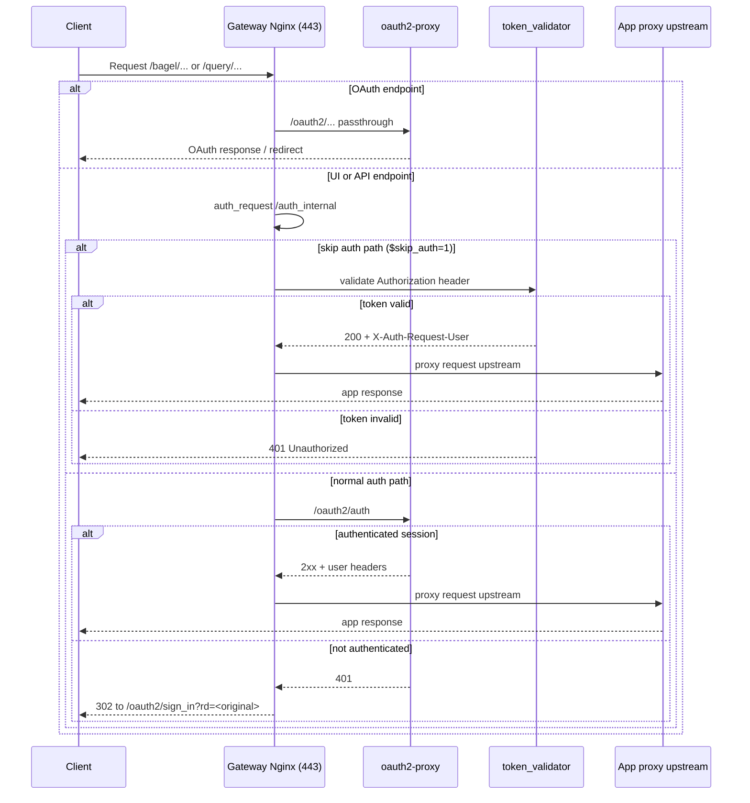
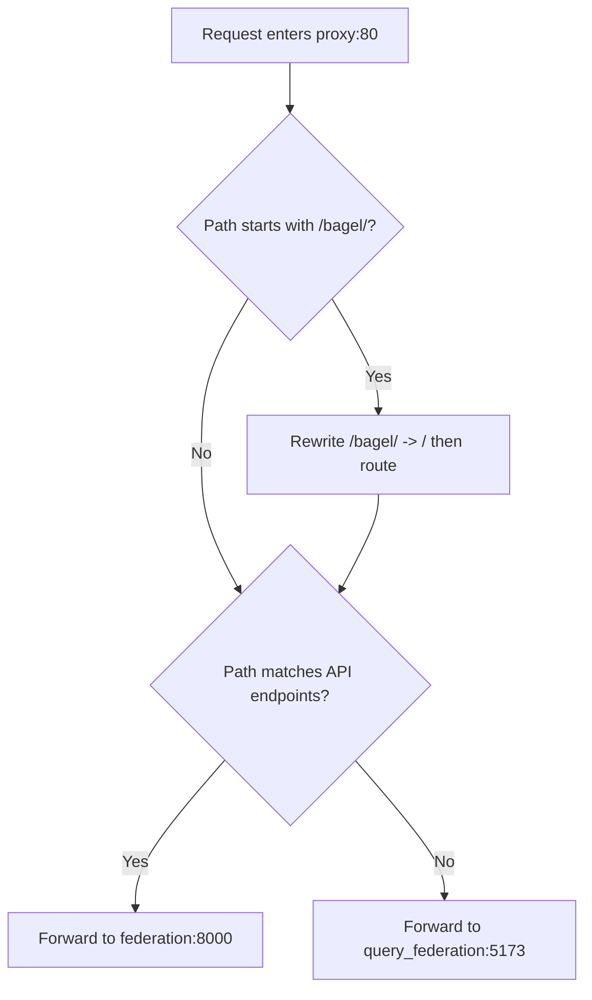
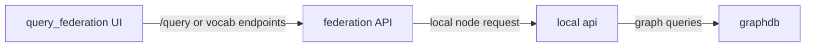

# NeuroBagel networking architecture

This page documents how traffic flows across the NeuroPoly deployment stack, from the browser to Nginx gateway/proxy layers and then to the NeuroBagel application services.

It is based on these configuration files:

- `docker-compose.prod.yml`
- `config/gateway/conf.d/default.conf`
- `config/proxy/conf.d/default.conf`
- `config/auth_validator/app.py`

## 1) Big-picture topology

The deployment uses two Docker networks:

- `default` (`neuropoly_nb_default`): internal app and data plane
- `proxy-net` (`neuropoly_nb_proxy`, external): public-facing auth/proxy plane

The `gateway` service is the single public ingress (`NB_GATEWAY_PORT_HOST:443`).

```mermaid
flowchart LR
    U[Browser client]
        GATE[gateway\n(member of default + proxy-net)]

    subgraph N1[default network - neuropoly_nb_default]
      API[api]
      GRAPH[graph]
      FED[federation]
      QF[query_federation]
      INIT[init_data]
    end

    subgraph N2[proxy-net network - neuropoly_nb_proxy]
      PROXY[proxy]
      O2P[oauth2-proxy]
      TV[token_validator]
    end

    U -->|HTTPS : NB_GATEWAY_PORT_HOST| GATE

    GATE -->|UI and API upstream| PROXY
    GATE -->|OAuth2 endpoints| O2P
    GATE -->|Bearer token fallback| TV

    PROXY -->|/query, /nodes, /datasets, ...| FED
    PROXY -->|all other UI routes| QF

    FED -->|node queries| API
    API -->|SPARQL/Graph access| GRAPH
    INIT -->|seed processing| API
    INIT -->|seed processing| GRAPH
```

## 2) Service roles

| Service | Primary role | Networks | Public port |
|---|---|---|---|
| `gateway` | TLS ingress + auth gate + path dispatch | `default`, `proxy-net` | Yes (`NB_GATEWAY_PORT_HOST:443`) |
| `oauth2-proxy` | GitHub OAuth2 session management | `proxy-net` | No |
| `token_validator` | Validates `Authorization` token against GitHub API and org membership | `proxy-net` | No |
| `proxy` | Internal app reverse proxy (federation API + query UI) | `proxy-net` | No |
| `query_federation` | Query UI frontend | `default`, `proxy-net` | No |
| `federation` | Federation API aggregator | `default`, `proxy-net` | No |
| `api` | Local NeuroBagel API | `default` | No |
| `graph` | GraphDB backend | `default` | No |
| `init_data` | Seed dataset ingestion job | `default` | No |

## 3) Gateway request flow (auth + routing)

The gateway Nginx acts as a smart edge:

- Intercepts OAuth paths (`/.../oauth2/...`) and forwards directly to `oauth2-proxy`.
- Uses `auth_request /auth_internal` for UI/API requests.
- For API paths, forwards to internal `app_proxy` upstream if authorized.
- For UI routes, forwards to the same `app_proxy` upstream and preserves auth cookies.
- When auth is skipped (`$skip_auth = 1`), returns internal code `418` and falls back to `token_validator`.



## 4) Internal proxy behavior (UI vs API split)

The `proxy` Nginx is an application router on port `80`:

- API routes (`/query`, `/nodes`, `/datasets`, `/docs`, `/openapi.json`, etc.) go to `federation:8000`.
- All other routes go to `query_federation:5173`.
- It supports both prefixed and non-prefixed URL styles. For `/bagel/...`, it rewrites to root before forwarding.



## 5) End-to-end routes

### Query UI page load

1. Browser calls `https://<gateway-host>:<NB_GATEWAY_PORT_HOST>/...`.
2. Gateway validates user (OAuth session or token fallback).
3. Gateway proxies request to `proxy`.
4. Internal proxy routes UI paths to `query_federation`.

### Federated API call from UI

1. Browser calls API-like path on the same origin (`/query`, `/nodes`, etc.).
2. Gateway validates auth and forwards to `proxy`.
3. Internal proxy forwards API path to `federation`.
4. Federation aggregates data from configured nodes (including local services).

### Local node data path



## 6) Profiles and deployment intent

- `node` profile: local node core (`init_data`, `graph`, `api`).
- `portal` profile: user-facing portal (`query_federation`, `federation`, `proxy`, `oauth2-proxy`, `token_validator`, `gateway`).

In the fused production compose, the two profiles combine into one complete, secured path from browser to graph while keeping most services private to Docker networks.

## 7) Operational notes

- Only `gateway` is intended for direct external access.
- `oauth2-proxy` handles login/session flows; `token_validator` enables bearer-token validation fallback.
- `proxy` centralizes internal app routing so UI and API stay behind one browser origin.
- `federation` is the API fan-in point for both local and remote nodes.
