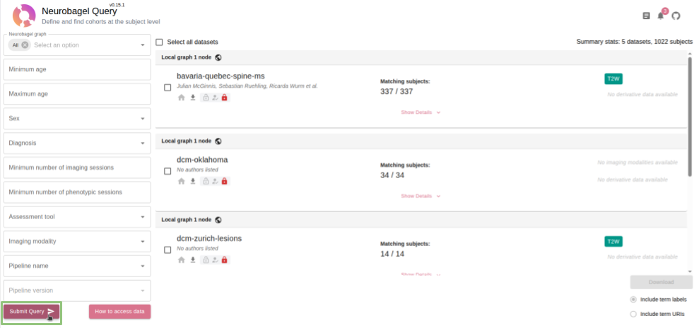
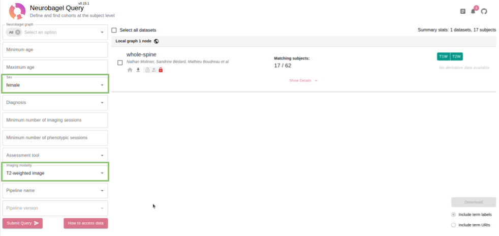
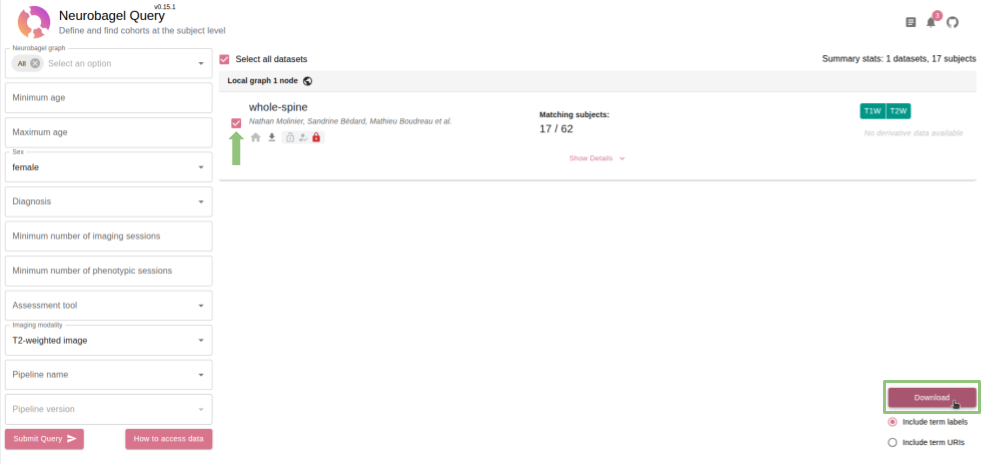

# NeuroBagel querying

## Query User Interface

NeuroBagel exposes a user-friendly web interface to query and explore the datasets available in the node. Use the URL `http://localhost:9000` to access the interface (replace the port number with the value of `NB_QUERY_PORT_HOST` if you changed it in the `.env` file).

Once open, **click on `Submit Query`** to display the full list of available datasets.



### Refining the query results

Use the **filters stacked on the left of the interface** to refine the query results using _age ranges_, _sex_, _diagnoses_, _imaging modalities_ and more. Once satisfied, **click on the `Submit Query`** button again.

Datasets matching the selected filters will be displayed on the right, with the number of matching subjects they contain, as well as the list of available data modalities associated to their imaging sessions.



### Exporting the query results

Use the **tick boxes on the left of each dataset card** to select the datasets to export. This activates the **Download** button at the bottom right of the interface.



The exported query results is saved in a **T**ab-**S**eparated-**V**alue (**TSV**) file, with one line per subject and imaging/phenotypic session. In it you'll find most of the metadata associated with the subjects matching the query, like their age, sex, diagnosis, etc. The table below describes some interesting columns, aside `sex`, `age` and `diagnosis` :

|                            |                                                                                            |
|----------------------------|--------------------------------------------------------------------------------------------|
|        `DatasetName`       | Name of the dataset the subject belongs to.                                                |
|       `RepositoryURL`      | URL of the repository hosting the dataset.                                                 |
|         `SubjectID`        | Identifier of the subject.                                                                 |
|         `SessionID`        | Identifier of the imaging/phenotypic session.                                              |
|    `ImagingSessionPath`    | Relative path to the imaging session in the repository.                                    |
| `SessionImagingModalities` | Name of the imaging modalities available in the session (e.g. `T1w`, `T2w`, `fMRI`, etc.). |
|        `AccessLink`        | Link to access the session data.                                                           |

### Downloading the imaging data from the query results

#### Prerequisites

> [!IMPORTANT]
> Setup your [NeuroGitea](https://data.neuro.polymtl.ca) account for automated access, following [these instructions](../neurogitea/account.md).

> [!IMPORTANT]
> Ensure that you have installed `npdb` ([see instructions](../npdb/install.md)). To verify installation, run: `uv run npdb`

> [!WARNING]
> The download procedure uses `git-annex`. Your **git provider** must be setup for `ssh` authentication, and your **SSH keys** must be properly configured on your machine. **For the NeuroPoly NeuroGitea instance, refer to [this setup guide](https://intranet.neuro.polymtl.ca/data/git-datasets.html#initial-setup).** 

The exported query results contains an `AccessLink` column that, when possible, will be filled with an URL to download the imaging data associated with each session. **For datasets indexed on `git`, this is not possible.** Instead, use the `npdb download` command line tool with the `--git` option (additionally use the `--git-annex` option if necessary) :

```bash
uv run npdb download --git --git-annex <query-results.tsv>
```
