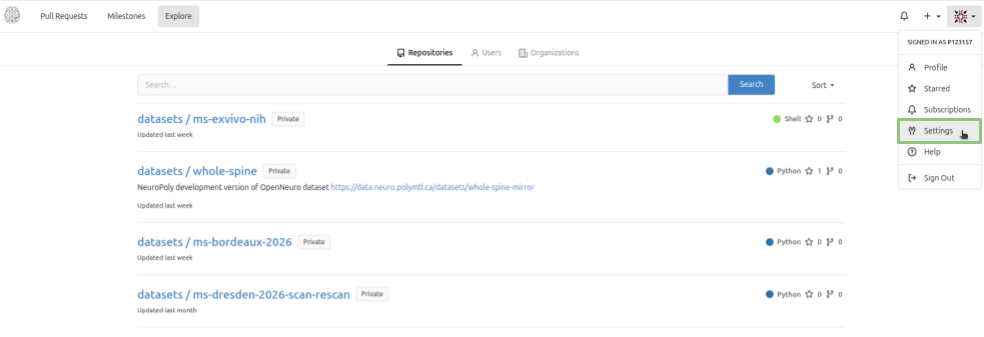
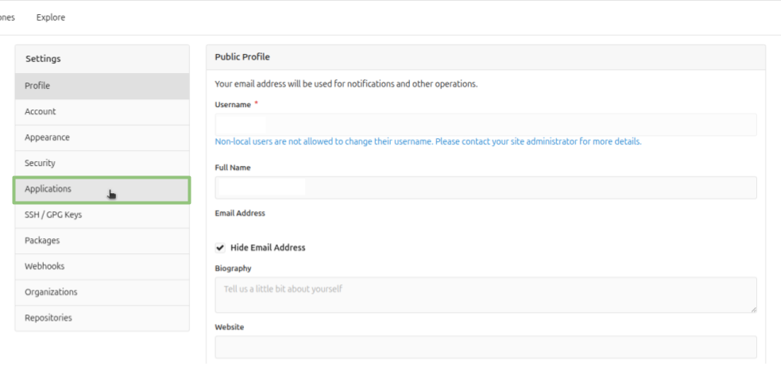
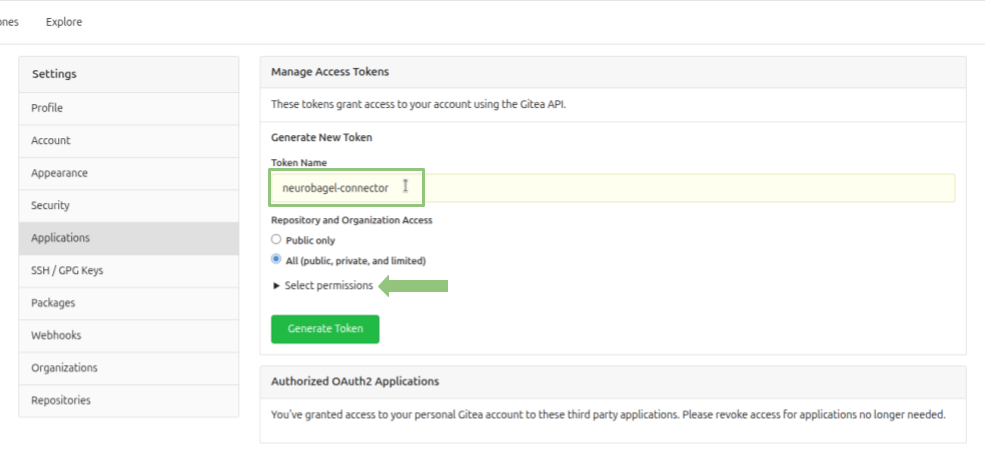
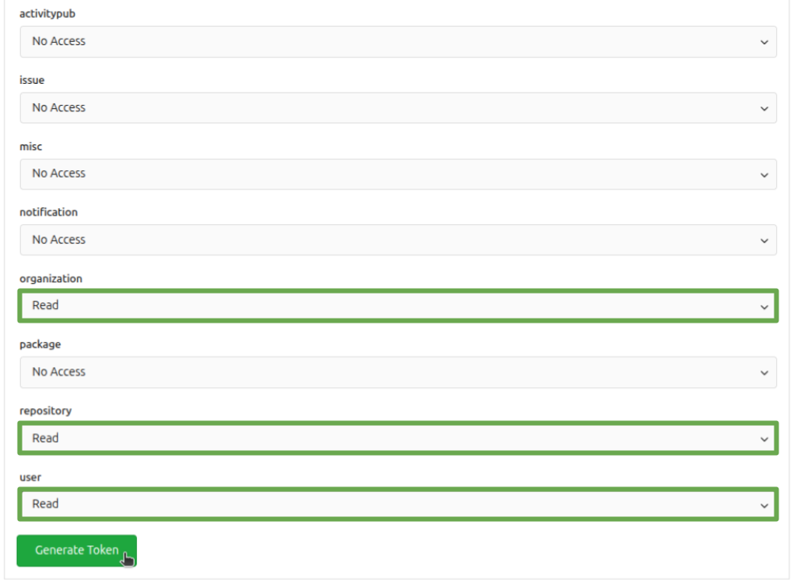
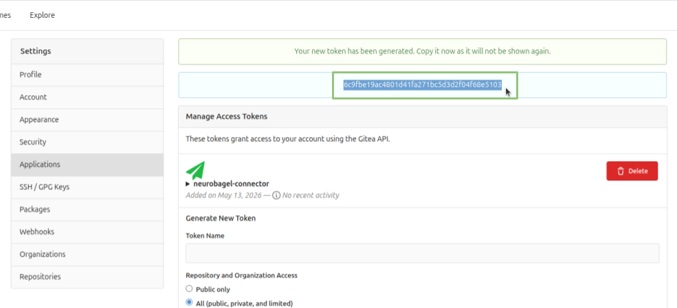

# NeuroGitea token creation

Neurogitea allows users to create **personal access tokens** to authenticate their applications and automated workflows with its API. Follow the instructions below to generate a token with the right permissions for **neuropoly-db**.

1. Log into the NeuroPoly [NeuroGitea](https://data.neuro.polymtl.ca) instance with your account.

2. Open the user settings by clicking on your profile picture at the top right of the page, then click on **Settings**.

   

3. In the left sidebar, click on **Applications**.

   

4. Give a name to your token (e.g. `neuropoly-db token`) and click on `Select permissions` to unwrap the permissions menu.

   

5. Select `Read` permissions for the **organization**, **repository** and **user** scopes. Then, click `Generate Token` below the permissions menu.

   

6. Copy the generated token and save it somewhere safe. **It's the only time you'll be able to see it**.

   
